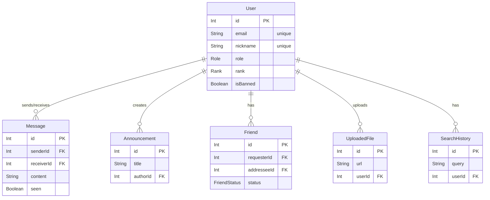

# Proje Veritabanı Şeması (ER Diagram)

Bu dosya, projenin veritabanı modelleri ve aralarındaki ilişkileri gösteren bir Varlık-İlişki (ER) diyagramı içerir. Diyagram, [Mermaid.js](https://mermaid-js.github.io/mermaid/#/) sözdizimi kullanılarak oluşturulmuştur.

